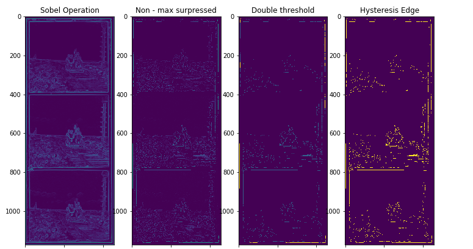

# Canny Edge Detection Algorithm
Implemented based on https://en.wikipedia.org/wiki/Canny_edge_detector
### Original Image

### Different Stages of Edge Detection

- Gaussian filter to smooth the image
- Find the image gradient
- Non-Max Surpression
- Double Threshold
- Edge hysteresis
